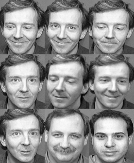
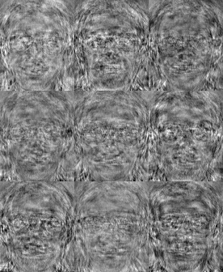
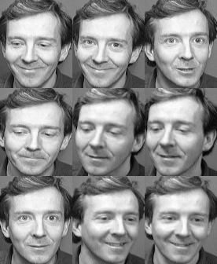
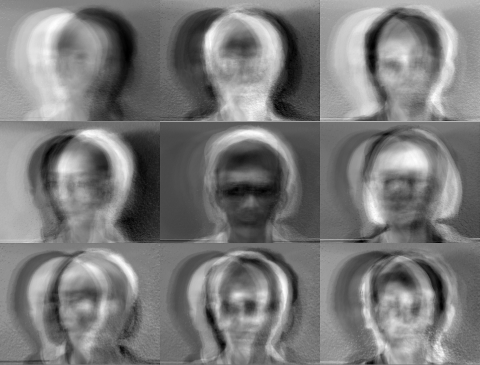
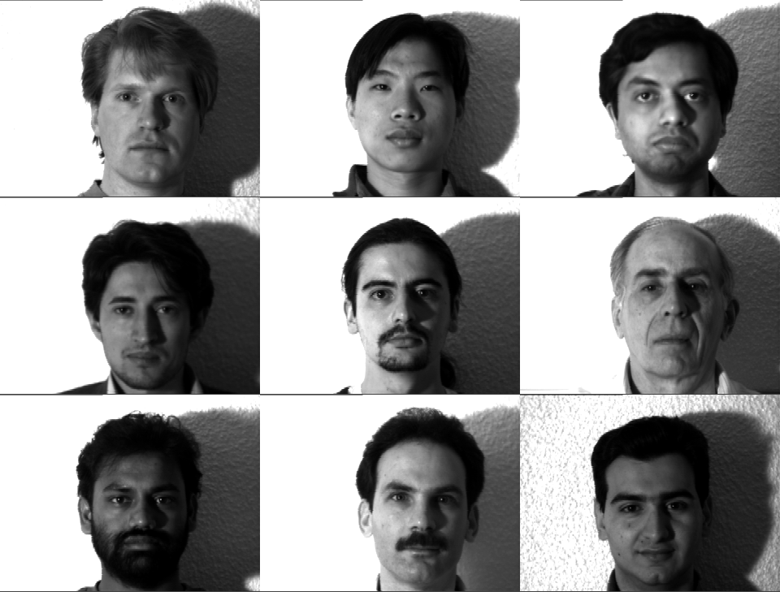
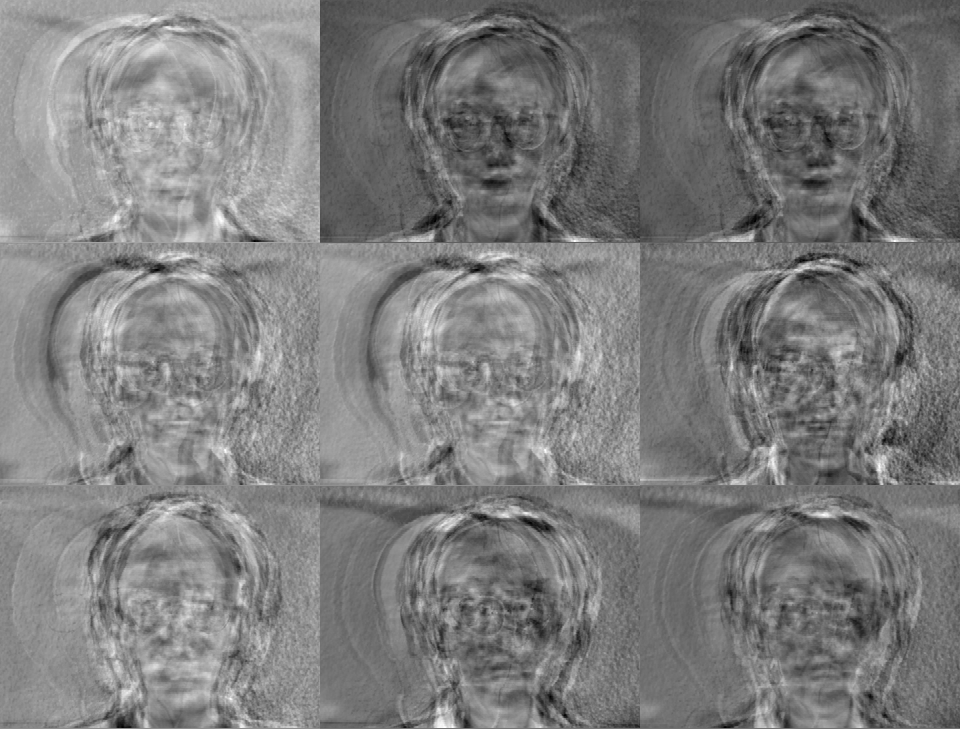
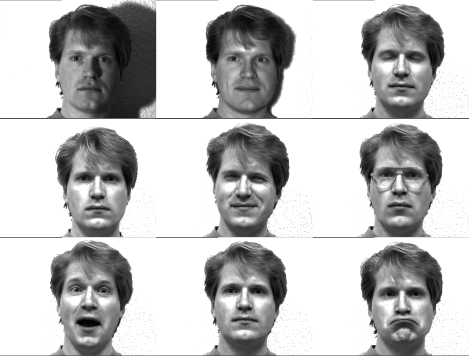

# Face Recognition Library
#### Developed by Kristian Lauszus, 2016

The code is released under the GNU General Public License.
_________

This library can be used in order to calculate [Eigenfaces](http://www.face-rec.org/algorithms/PCA/jcn.pdf) and [Fisherfaces](https://cseweb.ucsd.edu/classes/wi14/cse152-a/fisherface-pami97.pdf) in C++.

This Eigenfaces are calculated efficiently as described in the [paper](http://www.face-rec.org/algorithms/PCA/jcn.pdf) by M. Turk and A. Pentland.

The [Eigenfaces.m](Eigenfaces.m) Matlab script was used for development and was then ported to C++.

If you want to convert the PGM image run the [convert_pgm.sh](convert_pgm.sh) script.

## Documentation

Some information can be found in the [Eigenfaces_Report.pdf](Eigenfaces_Report.pdf).

The [final project report](Final_Project_Report.pdf) describing Fisherfaces and the [Android application](#android-application) is available as well.

A short blog post can be found at the following link: <http://blog.tkjelectronics.dk/2017/07/face-recognition-using-eigenfaces-and-fisherfaces>.

The source is documentated using [Doxygen](http://www.stack.nl/~dimitri/doxygen). The documentation can be found at the following link: <http://lauszus.github.io/FaceRecognitionLib>.

## AT&T Facedatabase

When using the code with the [AT&T Facedatabase](http://www.cl.cam.ac.uk/research/dtg/attarchive/facedatabase.html) the output looks like this:

#### Eigenfaces:

 

#### Fisherfaces:

 

Notice how the Eigenfaces is only slightly worse compared to Fisherfaces.

## Yale Face Database

However when using the [Yale Face Database](http://vision.ucsd.edu/content/yale-face-database) the difference is significant:

#### Eigenfaces:

 

#### Fisherfaces:

 

This clearly shows the weakness of Eigenfaces, as it only maximizes the scatter between classes and thus end up matching all images with light coming from the left side.

Note you need to prepare the Yale Face Database by running the [convert_yalefaces.sh](convert_yalefaces.sh) script first.

## Android application

This library was used for an [Android application](https://github.com/Lauszus/FaceRecognitionApp). Some screenshots can be seen below:

<a href="https://github.com/Lauszus/FaceRecognitionApp"></a>

## Build instructions

In order to build the C++ code and run the script you need to install [Eigen3](http://eigen.tuxfamily.org) and [ImageMagick](http://www.imagemagick.org):

Mac:

```bash
brew install eigen imagemagick
```

Ubuntu:

```bash
sudo apt-get install libeigen3-dev imagemagick
```

The [RedSVD](https://github.com/ntessore/redsvd-h) library is included as a submodule.

For more information send me an email at <lauszus@gmail.com>.
