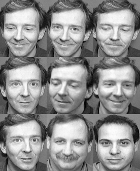
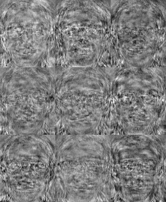
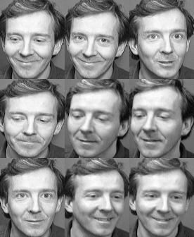

# Face Recognition Library
#### Developed by Kristian Lauszus, 2016

The code is released under the GNU General Public License.
_________

This library can be used in order to calculate [Eigenfaces](http://www.face-rec.org/algorithms/PCA/jcn.pdf) and [Fisherfaces](http://www.cs.columbia.edu/~belhumeur/journal/fisherface-pami97.pdf) in C++

This Eigenfaces are calculated efficiently as described in the [paper](http://www.face-rec.org/algorithms/PCA/jcn.pdf) by M. Turk and A. Pentland.

The code was tested using images from the [AT&T Facedatabase](http://www.cl.cam.ac.uk/research/dtg/attarchive/facedatabase.html).

The [Eigenfaces.m](Eigenfaces.m) Matlab script was used for development and was then ported to C++.

If you want to convert the PGM image run the [convert_pgm.sh](convert_pgm.sh) script. The output will look something like this:

#### Eigenfaces:

 

#### Fisherfaces:

 

Notice how the Fisherfaces successfully matches all images of the target.

## Build instructions

In order to build the C++ code and run the script you need to install [Eigen3](http://eigen.tuxfamily.org) and [ImageMagick](http://www.imagemagick.org):

Mac:

```bash
brew install eigen imagemagick
```

Ubuntu:

```bash
sudo apt-get install libeigen3-dev imagemagick
```

The [RedSVD](https://github.com/ntessore/redsvd-h) library is included as a submodule.

For more information send me an email at <lauszus@gmail.com>.
